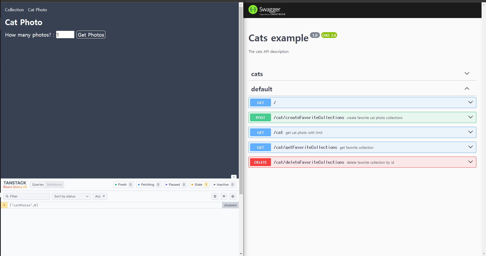
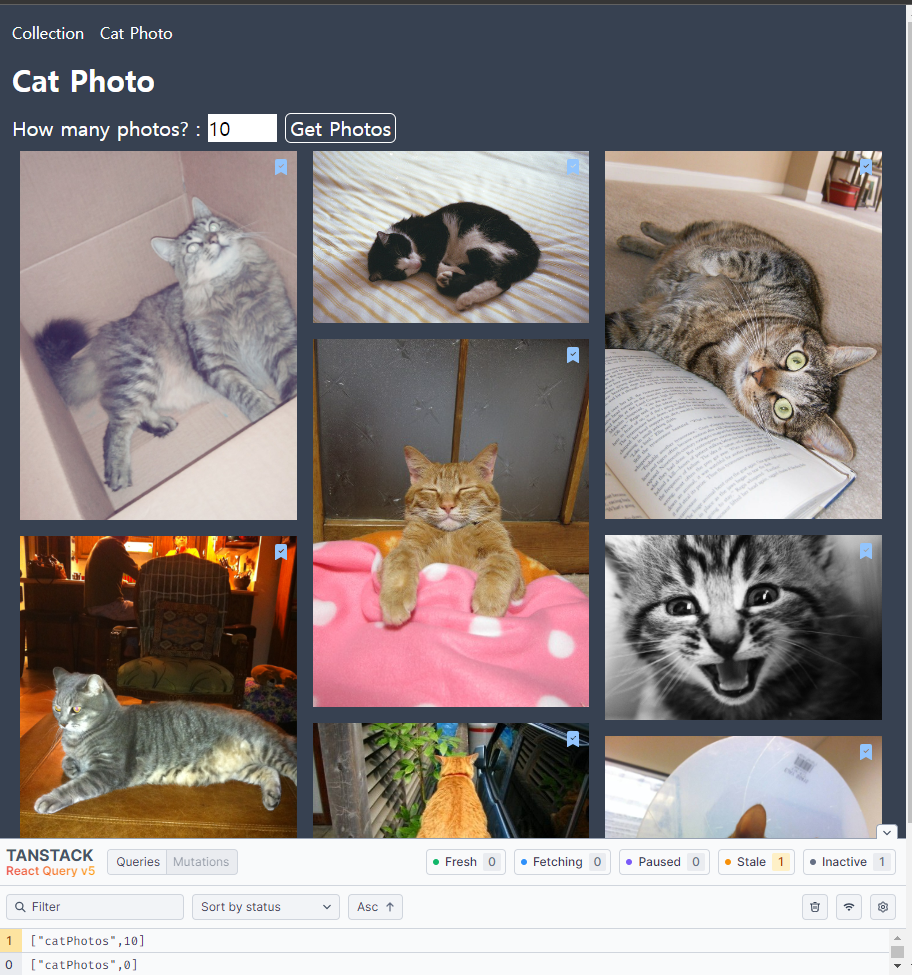
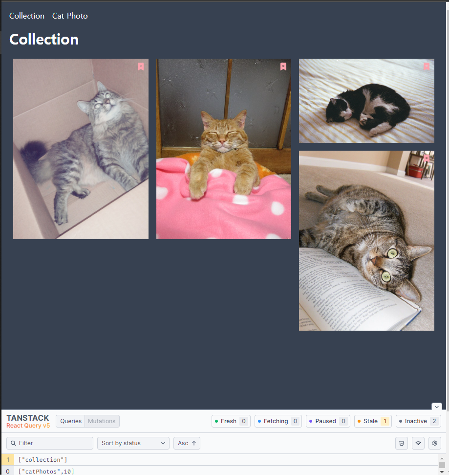
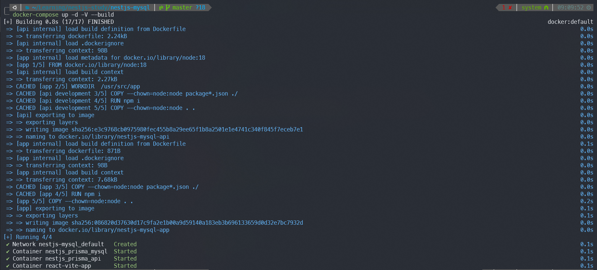
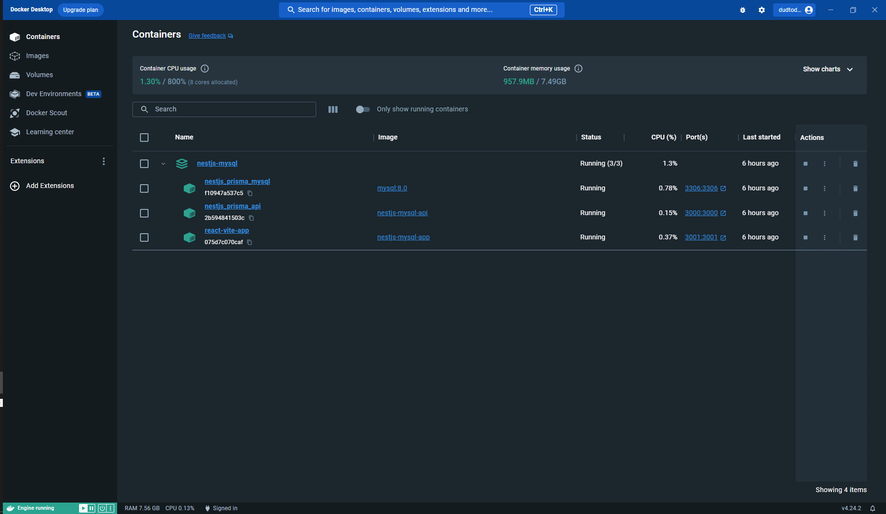

# Query Cat

## Study for React-Query Docker Nestjs Prisma

initial page

fetch cat img from nestjs backend using react-query

- reusable api structuring using axios instance
- useMutation, useQuery custom hooks
- masonry layout

bookmarks

command docker-compose

db, client, server container running
